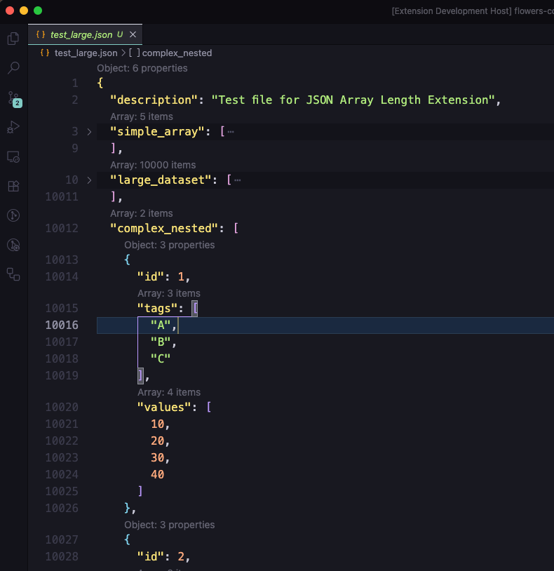
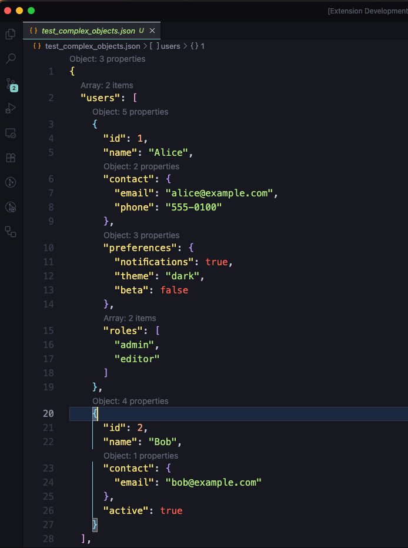

# JSON Length

<!-- Allow for a standard VS Code extension banner here if you have one -->

  

A high-performance Visual Studio Code extension that displays the **length of arrays** and the **number of properties in objects** directly in your JSON files using CodeLens.

## Features

- **⚡️ Instant Performance**: Built with a high-speed streaming parser (`jsonc-parser`) that handles massive JSON files (100k+ lines) instantly without freezing your editor.
- **🔢 Smart Counting**:
  - Shows item count for Arrays (`[ ... ]`).
  - Shows property count for Objects (`{ ... }`).
- **🎯 Precision**: Works correctly with nested structures, matrices, and mixed types.
- **⚙️ Configurable**: Toggle what you want to see via settings.

## Usage

Simply open any `.json` or `.jsonc` file. The extension will automatically display CodeLenses above arrays and objects.

- **Arrays**: `Array: 5 items`
- **Objects**: `Object: 3 properties`

## Extension Settings

This extension contributes the following settings:

- `jsonLength.enable`: Enable/disable the extension (default: `true`).
- `jsonLength.showArrayLength`: Show item count for arrays (default: `true`).
- `jsonLength.showObjectPropertyCount`: Show property count for objects (default: `true`).

## Known Issues

- None reported.

## Release Notes

### 0.0.1

- Initial release.
- Support for counting array items and object properties.
- Performance optimization for large files.

---

**Enjoying this extension?** Please rate it on the Marketplace!
